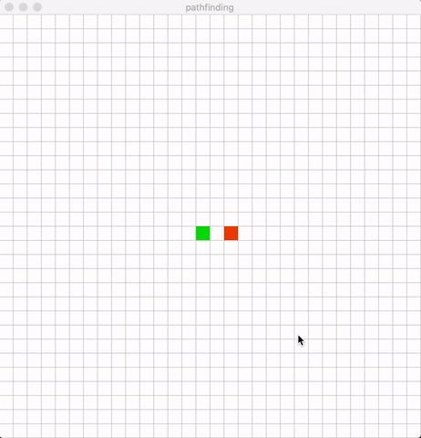

# pathfinding
A pathfinding visualizer made by C++ and SFML framework. The progrom uses Breadth-First Search algorithm to calculate and
display the shortest path from starting point(green square) to the target(red square).

# How to use
Drag the green square and red square around the board to set the position of the starting point and the target.

Drawing obstacles:
 - Click anywhere on an empty square (white square) to create an obstacle on the board.
 - Users can hold the mouse while drawing obstacles to create continuous obstacles.

Removing obstacles:
 - Click an obstacle (gray square) again to remove an obstacle on the board.
 - Users can hold the mouse while removing obstacles to clear quickly.
 
Click Enter to run the program to show the path between starting point and the target.

